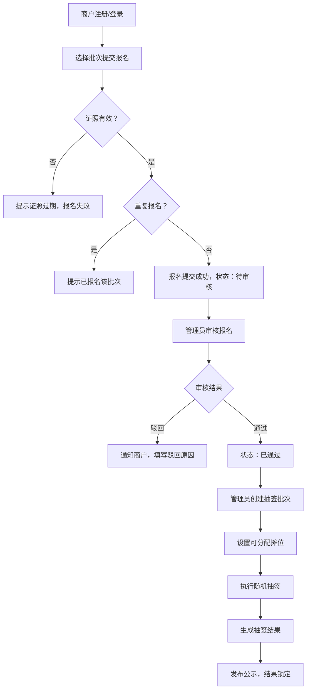

## 1. 产品概述

农贸市场摊位抽签管理系统，面向农贸市场管理方和商户，提供从商户报名、资质审核到摊位抽签、结果公示的全流程数字化管理。系统确保证照有效性校验、防止重复报名、抽签结果不可篡改，提升摊位分配的公平性和透明度。

- 目标用户：农贸市场管理方（管理员）、市场商户
- 核心价值：数字化替代线下抽签流程，保障公平公正，提高管理效率

## 2. 核心功能

### 2.1 用户角色

| 角色 | 注册方式 | 核心权限 |
|------|----------|----------|
| 商户 | 自助注册 | 提交报名、查看抽签结果、查看公示 |
| 管理员 | 后台分配 | 审核报名、创建批次、执行抽签、发布公示 |

### 2.2 功能模块

1. **报名页面**：商户信息填报、证照上传、报名状态跟踪
2. **审核页面**：报名列表、资质审核（通过/驳回）、证照有效性校验
3. **抽签页面**：批次管理、可分配摊位设置、执行抽签、抽签动画
4. **公示页面**：抽签结果公示、按批次查看、不可修改标记

### 2.3 页面详情

| 页面名称 | 模块名称 | 功能描述 |
|----------|----------|----------|
| 报名页面 | 商户信息表单 | 填写商户名称、联系人、手机号、经营品类，上传营业执照和食品经营许可证 |
| 报名页面 | 证照校验 | 系统自动校验证照有效期，过期证照不允许提交报名 |
| 报名页面 | 重复报名检测 | 同一商户（同一手机号或同一证照号）不可重复报名同一批次 |
| 报名页面 | 报名状态 | 显示当前报名的审核状态（待审核/已通过/已驳回） |
| 审核页面 | 报名列表 | 按批次展示待审核报名，支持筛选和搜索 |
| 审核页面 | 审核操作 | 查看证照详情，通过或驳回报名（驳回需填写原因） |
| 审核页面 | 证照预览 | 在线预览商户上传的证照图片 |
| 抽签页面 | 批次管理 | 创建抽签批次，设置批次名称、可分配摊位数量和编号 |
| 抽签页面 | 执行抽签 | 对已通过审核的商户执行随机抽签，分配摊位 |
| 抽签页面 | 抽签动画 | 抽签过程展示滚动动画效果 |
| 公示页面 | 结果公示 | 按批次展示抽签结果，包含商户信息和分配的摊位编号 |
| 公示页面 | 结果锁定 | 已公示的抽签结果不可修改，显示锁定标识 |

## 3. 核心流程

商户在报名期内提交报名信息和证照，系统自动校验证照有效性和重复报名；管理员审核报名资质，通过或驳回；审核通过后，管理员创建抽签批次并设置可分配摊位，执行随机抽签；抽签结果公示后锁定不可修改。

## 4. 用户界面设计

### 4.1 设计风格

- **主色调**：深松绿 (#1B4332) 搭配暖琥珀色 (#D4A017) 作为点缀，传达市场的生机与管理的权威感
- **辅助色**：米白 (#FAF8F5) 为底，浅灰 (#E8E4DF) 为卡片背景
- **按钮风格**：圆角按钮（rounded-lg），主操作用实心深绿，次操作用描边样式
- **字体**：标题使用 Noto Serif SC（衬线），正文使用 Noto Sans SC（无衬线），大小层级：标题 24px/副标题 18px/正文 14px/辅助 12px
- **布局风格**：顶部导航 + 内容区居中卡片布局，最大宽度 1200px
- **图标风格**：线性图标，来自 lucide-react

### 4.2 页面设计概览

| 页面名称 | 模块名称 | UI 元素 |
|----------|----------|----------|
| 报名页面 | 商户信息表单 | 卡片式表单布局，输入框带图标前缀，证照上传区域带虚线边框和拖拽提示 |
| 报名页面 | 报名状态 | 顶部状态条（待审核黄/通过绿/驳回红），步骤指示器展示流程进度 |
| 审核页面 | 报名列表 | 表格布局，行内状态标签，右侧操作按钮组，顶部筛选栏 |
| 审核页面 | 证照预览 | 模态弹窗，图片缩放查看，审核操作按钮固定底部 |
| 抽签页面 | 批次管理 | 左侧批次列表，右侧配置面板，摊位编号标签式输入 |
| 抽签页面 | 抽签动画 | 全屏遮罩层，摊位编号滚动动画，结果揭晓时放大高亮 |
| 公示页面 | 结果公示 | 按批次的折叠面板，商户-摊位对应卡片，锁定图标标识，打印友好布局 |

### 4.3 响应式设计

- 桌面优先设计，最大内容宽度 1200px
- 平板端：侧边栏收缩为汉堡菜单，表格横向滚动
- 移动端：卡片堆叠布局，表单单列展示，底部固定操作栏

### 4.4 动效设计

- 页面切换：淡入淡出 (opacity + translateY)
- 卡片悬停：微上浮 + 阴影增强
- 抽签动画：摊位编号快速滚动 → 逐个减速停止 → 结果高亮闪烁
- 状态变化：颜色过渡 (transition-colors 300ms)
