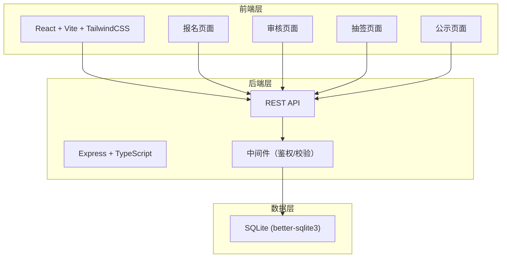
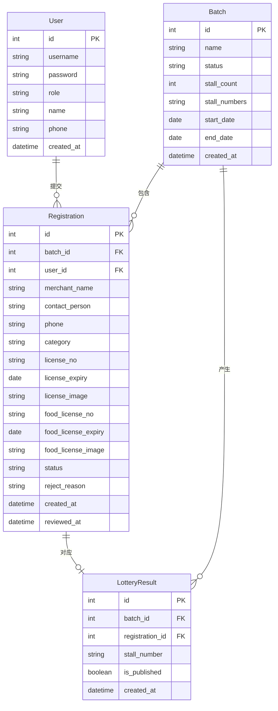

## 1. 架构设计



## 2. 技术说明

- **前端**：React@18 + TailwindCSS@3 + Vite + Zustand（状态管理）
- **初始化工具**：vite-init
- **后端**：Express@4 + TypeScript（ESM 格式）
- **数据库**：SQLite（better-sqlite3），容器环境通过挂载卷持久化
- **文件上传**：multer 处理证照图片上传，存储于 `uploads/` 目录
- **容器部署**：多阶段 Docker 构建，Nginx 托管前端静态资源 + 反向代理后端 API

## 3. 路由定义

| 路由 | 用途 |
|------|------|
| `/` | 首页，展示系统介绍和当前开放批次 |
| `/register` | 商户报名页面 |
| `/review` | 管理员审核页面 |
| `/lottery` | 管理员抽签操作页面 |
| `/publicity` | 抽签结果公示页面 |
| `/login` | 登录页面 |

## 4. API 定义

### 4.1 认证相关

```typescript
POST   /api/auth/register    // 商户注册
POST   /api/auth/login       // 登录
GET    /api/auth/me          // 获取当前用户信息
```

### 4.2 批次相关

```typescript
GET    /api/batches                // 获取批次列表
POST   /api/batches                // 创建批次（管理员）
PUT    /api/batches/:id            // 更新批次信息（管理员）
GET    /api/batches/:id            // 获取批次详情
```

### 4.3 报名相关

```typescript
GET    /api/registrations                    // 获取报名列表（支持批次/状态筛选）
POST   /api/registrations                    // 提交报名
GET    /api/registrations/:id                // 获取报名详情
PUT    /api/registrations/:id/status         // 审核报名（管理员：通过/驳回）
GET    /api/registrations/check-duplicate    // 检查重复报名
```

### 4.4 抽签相关

```typescript
POST   /api/lottery/execute/:batchId    // 执行抽签（管理员）
GET    /api/lottery/results/:batchId    // 获取抽签结果
GET    /api/lottery/results             // 获取所有已公示结果
```

### 4.5 文件上传

```typescript
POST   /api/upload/license    // 上传证照图片
GET    /api/uploads/:filename  // 获取上传的文件
```

### 4.6 数据类型定义

```typescript
interface User {
  id: number;
  username: string;
  password: string;
  role: "merchant" | "admin";
  name: string;
  phone: string;
  created_at: string;
}

interface Batch {
  id: number;
  name: string;
  status: "open" | "closed" | "lottery_done" | "published";
  stall_count: number;
  stall_numbers: string;
  start_date: string;
  end_date: string;
  created_at: string;
}

interface Registration {
  id: number;
  batch_id: number;
  user_id: number;
  merchant_name: string;
  contact_person: string;
  phone: string;
  category: string;
  license_no: string;
  license_expiry: string;
  license_image: string;
  food_license_no: string;
  food_license_expiry: string;
  food_license_image: string;
  status: "pending" | "approved" | "rejected";
  reject_reason: string;
  created_at: string;
  reviewed_at: string;
}

interface LotteryResult {
  id: number;
  batch_id: number;
  registration_id: number;
  stall_number: string;
  is_published: boolean;
  created_at: string;
}
```

## 5. 服务端架构图


## 6. 数据模型

### 6.1 数据模型定义



### 6.2 数据定义语言

```sql
CREATE TABLE users (
  id INTEGER PRIMARY KEY AUTOINCREMENT,
  username TEXT NOT NULL UNIQUE,
  password TEXT NOT NULL,
  role TEXT NOT NULL CHECK(role IN ('merchant', 'admin')),
  name TEXT NOT NULL,
  phone TEXT NOT NULL,
  created_at DATETIME NOT NULL DEFAULT (datetime('now'))
);

CREATE TABLE batches (
  id INTEGER PRIMARY KEY AUTOINCREMENT,
  name TEXT NOT NULL,
  status TEXT NOT NULL DEFAULT 'open' CHECK(status IN ('open', 'closed', 'lottery_done', 'published')),
  stall_count INTEGER NOT NULL,
  stall_numbers TEXT NOT NULL,
  start_date DATE NOT NULL,
  end_date DATE NOT NULL,
  created_at DATETIME NOT NULL DEFAULT (datetime('now'))
);

CREATE TABLE registrations (
  id INTEGER PRIMARY KEY AUTOINCREMENT,
  batch_id INTEGER NOT NULL,
  user_id INTEGER NOT NULL,
  merchant_name TEXT NOT NULL,
  contact_person TEXT NOT NULL,
  phone TEXT NOT NULL,
  category TEXT NOT NULL,
  license_no TEXT NOT NULL,
  license_expiry DATE NOT NULL,
  license_image TEXT NOT NULL,
  food_license_no TEXT,
  food_license_expiry DATE,
  food_license_image TEXT,
  status TEXT NOT NULL DEFAULT 'pending' CHECK(status IN ('pending', 'approved', 'rejected')),
  reject_reason TEXT,
  created_at DATETIME NOT NULL DEFAULT (datetime('now')),
  reviewed_at DATETIME,
  FOREIGN KEY (batch_id) REFERENCES batches(id),
  FOREIGN KEY (user_id) REFERENCES users(id),
  UNIQUE(batch_id, user_id),
  UNIQUE(batch_id, license_no)
);

CREATE TABLE lottery_results (
  id INTEGER PRIMARY KEY AUTOINCREMENT,
  batch_id INTEGER NOT NULL,
  registration_id INTEGER NOT NULL,
  stall_number TEXT NOT NULL,
  is_published INTEGER NOT NULL DEFAULT 0,
  created_at DATETIME NOT NULL DEFAULT (datetime('now')),
  FOREIGN KEY (batch_id) REFERENCES batches(id),
  FOREIGN KEY (registration_id) REFERENCES registrations(id),
  UNIQUE(batch_id, stall_number),
  UNIQUE(batch_id, registration_id)
);

CREATE INDEX idx_registrations_batch ON registrations(batch_id);
CREATE INDEX idx_registrations_user ON registrations(user_id);
CREATE INDEX idx_registrations_status ON registrations(status);
CREATE INDEX idx_lottery_batch ON lottery_results(batch_id);

INSERT INTO users (username, password, role, name, phone) VALUES ('admin', 'admin123', 'admin', '系统管理员', '13800000000');
```
